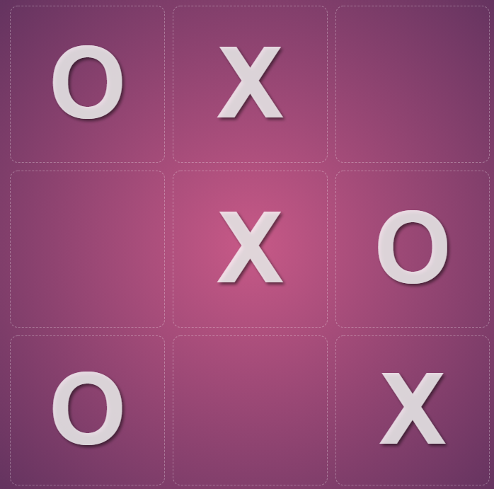
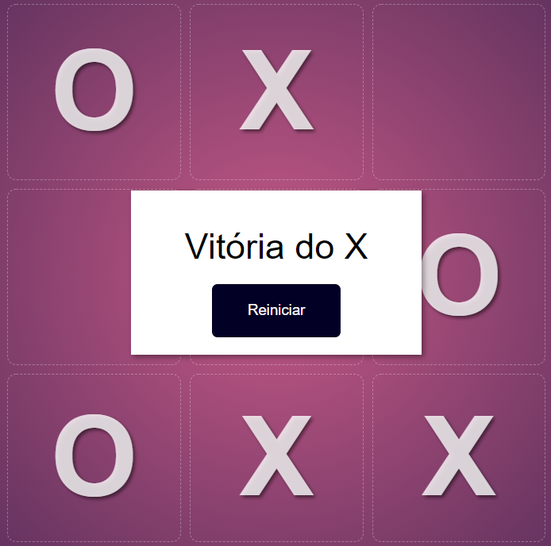

> # #️⃣ Tic tac toe

 

> ## 🎒 About

 

With this simple game (Tic Tac Toe) I finish my repositories based on programming logic training (3/3)

Here, as in other projects, the goal was not good practices or styling, this project was just to practice programming logic.

> ## 🚀 Here we have

 

<ul>
<li>JavaScript</li>
<li>Html</li>
<li>Css</li>
</ul>

 

> ### ❤️ Lastly

 If you want to check the other repositories belonging to this "series" 

<ul>
<li><a href='https://github.com/JoaoMarcelo-J/memory-game'>Memory Game</a></li>
<li><a href='https://github.com/JoaoMarcelo-J/js-pomodoro'>Pomodoro</a></li>
</ul>

 

   

